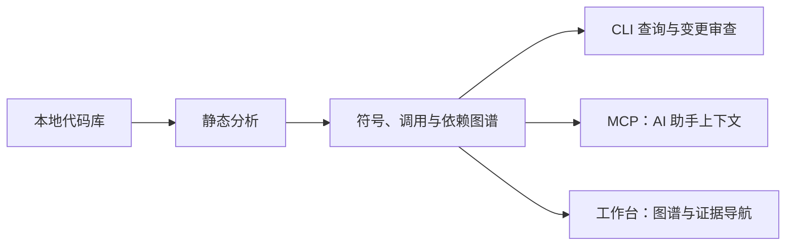

# CodeLattice

**面向开发者与 AI 编程助手的本地代码图谱引擎。**

理解项目结构，追踪调用与依赖，评估改动影响，让每一步代码审查都有可追溯的依据。

[快速开始](#快速开始) · [接入 AI 助手](#接入-ai-助手) · [可视化工作台](#可视化工作台) · [支持语言](#支持语言) · [文档](#文档) · [English](docs/README.en.md)

[![zread](https://img.shields.io/badge/Ask_Zread-_.svg?style=flat&color=00b0aa&labelColor=000000&logo=data%3Aimage%2Fsvg%2Bxml%3Bbase64%2CPHN2ZyB3aWR0aD0iMTYiIGhlaWdodD0iMTYiIHZpZXdCb3g9IjAgMCAxNiAxNiIgZmlsbD0ibm9uZSIgeG1sbnM9Imh0dHA6Ly93d3cudzMub3JnLzIwMDAvc3ZnIj4KPHBhdGggZD0iTTQuOTYxNTYgMS42MDAxSDIuMjQxNTZDMS44ODgxIDEuNjAwMSAxLjYwMTU2IDEuODg2NjQgMS42MDE1NiAyLjI0MDFWNC45NjAxQzEuNjAxNTYgNS4zMTM1NiAxLjg4ODEgNS42MDAxIDIuMjQxNTYgNS42MDAxSDQuOTYxNTZDNS4zMTUwMiA1LjYwMDEgNS42MDE1NiA1LjMxMzU2IDUuNjAxNTYgNC45NjAxVjIuMjQwMUM1LjYwMTU2IDEuODg2NjQgNS4zMTUwMiAxLjYwMDEgNC45NjE1NiAxLjYwMDFaIiBmaWxsPSIjZmZmIi8%2BCjxwYXRoIGQ9Ik00Ljk2MTU2IDEwLjM5OTlIMi4yNDE1NkMxLjg4ODEgMTAuMzk5OSAxLjYwMTU2IDEwLjY4NjQgMS42MDE1NiAxMS4wMzk5VjEzLjc1OTlDMS42MDE1NiAxNC4xMTM0IDEuODg4MSAxNC4zOTk5IDIuMjQxNTYgMTQuMzk5OUg0Ljk2MTU2QzUuMzE1MDIgMTQuMzk5OSA1LjYwMTU2IDE0LjExMzQgNS42MDE1NiAxMy43NTk5VjExLjAzOTlDNS42MDE1NiAxMC42ODY0IDUuMzE1MDIgMTAuMzk5OSA0Ljk2MTU2IDEwLjM5OTlaIiBmaWxsPSIjZmZmIi8%2BCjxwYXRoIGQ9Ik0xMy43NTg0IDEuNjAwMUgxMS4wMzg0QzEwLjY4NSAxLjYwMDEgMTAuMzk4NCAxLjg4NjY0IDEwLjM5ODQgMi4yNDAxVjQuOTYwMUMxMC4zOTg0IDUuMzEzNTYgMTAuNjg1IDUuNjAwMSAxMS4wMzg0IDUuNjAwMUgxMy43NTg0QzE0LjExMTkgNS42MDAxIDE0LjM5ODQgNS4zMTM1NiAxNC4zOTg0IDQuOTYwMVYyLjI0MDFDMTQuMzk4NCAxLjg4NjY0IDE0LjExMTkgMS42MDAxIDEzLjc1ODQgMS42MDAxWiIgZmlsbD0iI2ZmZiIvPgo8cGF0aCBkPSJNNCAxMkwxMiA0TDQgMTJaIiBmaWxsPSIjZmZmIi8%2BCjxwYXRoIGQ9Ik00IDEyTDEyIDQiIHN0cm9rZT0iI2ZmZiIgc3Ryb2tlLXdpZHRoPSIxLjUiIHN0cm9rZS1saW5lY2FwPSJyb3VuZCIvPgo8L3N2Zz4K&logoColor=ffffff)](https://zread.ai/aiulms/codelattice)

CodeLattice 用 Rust 编写，通过静态分析将代码库整理成可查询的工程图谱。它适合接手陌生项目、维护大型遗留代码、规划重构和做提交前审查，既可以通过 CLI 独立使用，也可以通过 MCP 为 AI 助手提供结构化上下文。

**当前版本：`v0.17.0-beta.2` · 外部 Beta。** 各语言与入口的成熟度不同；桌面 Workbench 为 P0 开发构建。版本详情见 [发行说明](docs/release/0.17.0-beta.2-notes.md)，实际下载以 [GitCode Releases](https://gitcode.com/aiulms/codelattice/releases) 的附件为准。

## 能帮你做什么

| 场景 | 你可以问的问题 | CodeLattice 提供的依据 |
|---|---|---|
| 接手项目 | “入口在哪里？哪些模块相互依赖？” | 项目与包结构、符号位置、调用链、工作区关系 |
| 修改前评估 | “改这个函数，哪些调用方可能受影响？” | 上下游关系、影响范围、风险理由与置信度 |
| 提交前审查 | “这次改动是否遗漏了 API、文档或测试的同步？” | 变更符号、兼容风险候选、相关文件与验证建议 |



关系结果保留源码位置、置信度与解析理由；图谱质量检查覆盖悬空边、重复节点等问题。你可以沿着证据回到源码复核，而不是只得到一段无法追溯的结论。**静态图谱不等同于运行时证明，清理候选也不能直接作为删代码的依据。**

## 快速开始

### 从源码体验一次分析

需要 Git、Rust/Cargo、Bash；自检脚本还需要 Python 3。macOS / Linux 的环境准备见 [入门指南](docs/getting-started.md) 和 [Linux / openEuler 构建指南](docs/platforms/linux-openeuler.md)。

```bash
git clone https://gitcode.com/aiulms/codelattice.git
cd codelattice
bash scripts/install-mcp.sh --build

target/release/codelattice analyze \
  --root fixtures/rust/portable-smoke \
  --language rust \
  --format json
```

默认构建启用当前全部语言适配器。成功后会输出项目摘要、图谱、诊断和质量检查结果。把 `--root` 换成你的项目目录即可继续；不确定语言时可用 `--language auto`，多项目根目录会返回工作区入口信息。

### 使用已发布的二进制

macOS Apple Silicon 用户可在 [Releases](https://gitcode.com/aiulms/codelattice/releases) 选择带 `darwin-arm64` 附件的版本。克隆仓库后，在仓库根目录运行：

```bash
export CODELATTICE_TOOL_DIR="$HOME/.local/share/codelattice-tool"
bash scripts/install-release.sh \
  --version v0.17.0-beta.2 \
  --install-dir "$CODELATTICE_TOOL_DIR"
"$CODELATTICE_TOOL_DIR/codelattice-mcp.sh" --self-test
```

安装器校验下载文件的 SHA-256，并安装稳定的 MCP 启动脚本。其他平台优先使用源码构建；完整安装、升级与回滚方法见 [安装指南](docs/release-install.md) 和 [升级指南](docs/release/upgrade.md)。

## 接入 AI 助手

通过 MCP 为 Codex、Claude Desktop、OpenCode 等客户端提供项目理解与变更审查上下文。

如果使用上面的源码构建路径，先将工具复制到稳定目录：

```bash
export CODELATTICE_TOOL_DIR="$HOME/.local/share/codelattice-tool"
bash scripts/promote-to-local-tool.sh --install-dir "$CODELATTICE_TOOL_DIR"
"$CODELATTICE_TOOL_DIR/codelattice-mcp.sh" --self-test
```

如果已用 release 安装器安装，可跳过这一步。随后打印客户端配置片段：

```bash
bash scripts/install-mcp.sh --print-config --install-dir "$CODELATTICE_TOOL_DIR"
```

脚本只打印配置，不自动修改客户端设置。按对应客户端格式填入稳定目录中的 `codelattice-mcp.sh` 绝对路径。

默认 MCP 模式提供 6 个按任务组织的入口：工作流、项目、符号、变更审查、工作区和缓存。接入后可以尝试：

- “用 CodeLattice 概览这个项目，列出入口、核心模块和分析限制。”
- “修改这个函数之前，检查它的调用方和潜在影响。”
- “审查当前改动，列出需要同步检查的文档、测试和公开 API。”

配置示例、工具选择和大项目异步查询见 [MCP 使用指南](docs/guides/ai-mcp-tool-guide.md)；更多提问方式见 [提示词示例](docs/guides/ai-prompt-cookbook.md)。

## 可视化工作台

| 入口 | 适合的用法 | 当前范围 |
|---|---|---|
| WebUI / Snapshot Viewer | 在浏览器中查看快照、搜索符号、浏览图谱与审查摘要 | 本地 Web 入口，支持 Runner 分析与工作区选择 |
| Desktop Workbench | 联动结构树、图谱、上下游证据和项目对话 | Tauri 桌面 P0 开发构建；签名安装器与自动更新需独立发布验证 |

在仓库根目录启动 WebUI：

```bash
bash scripts/webui-runner.sh --open
```

桌面工作台将静态分析结果与模型解释分开展示：选择节点或关系可以查看证据，模型解释需要显式触发，模型输出不会写回事实图谱。

[WebUI 使用指南](docs/webui/beta-user-guide.md) · [桌面 Workbench 使用指南](docs/webui/workbench-user-guide.md) · [桌面构建说明](apps/desktop/README.md)

## 支持语言

以下状态是各语言分析路径的成熟度，**不代表整个产品已达到 GA**。Fixture smoke 是静态契约验证，不代表完整语言语义或目标项目运行验证。

| 语言 | Beta 状态 | Fixture smoke | 主要支持 | 已知限制 |
|------|-----------|---------------|----------|----------|
| Rust | Stable | ✅ | Cargo 项目模型、符号、imports、CALLS、quality gates | 不做完整类型推断 / trait solving / macro expansion |
| Cangjie / 仓颉 | Stable | ✅ | cjpm 项目模型、符号、跨文件引用、调用、diagnostics | 不替代 cjc / cjlint |
| ArkTS / HarmonyOS | Production Trial | ✅ | HarmonyOS 项目识别、component/buildMethod、UI call extraction | 不完整解析 ArkUI DSL，不支持所有装饰器语义 |
| TypeScript | Beta hardened | ✅ | 符号、imports、calls、tsconfig paths、workspace package import | 不等同 tsc，不做类型系统求值 |
| C | Phase A hardened | ✅ | 符号、includes、compile_commands include path、qualityMetrics | 不做完整预处理器、宏展开或函数指针解析 |
| C++ | Phase A hardened | ✅ | 符号、includes、calls、compile_commands include path | 不做模板实例化、重载解析、虚调用解析 |
| Python | Phase A hardened | ✅ | 符号、calls、package import、relative import、re-export | 不执行代码，不解析动态 import / monkey patch |
| JavaScript | Phase A hardened | ✅ | JS/JSX/MJS/CJS 符号、ESM import/export、CommonJS require/module.exports、package.json 入口 | 静态分析，不执行代码；dynamic import/require 为 diagnostic；不索引 node_modules |
| Shell | Phase A hardened | ✅ | 脚本文件、函数、source 关系、命令调用、环境变量、风险诊断 | 不执行脚本，不替代 shellcheck，不展开复杂参数/条件 |

更细的语言策略和示例见 [CLI 与工程参考](docs/guides/cli-reference.md)。

## 本地运行与能力边界

- **分析引擎在本地运行**：不依赖云端索引，不上传源码，不执行目标项目代码、构建脚本或测试脚本。
- **模型解释是独立可选能力**：工作台连接远程模型时会发送结构化图证据；默认不发送源码正文。使用本地 Ollama 可让项目证据留在本机。通过外部 MCP 客户端使用时，数据处理还取决于该客户端和模型配置，详见 [工作台隐私边界](docs/webui/workbench-user-guide.md#4-模型池)。
- **结果有明确限制**：不做完整类型推断、Rust trait solving、宏展开或完整 C/C++ 预处理；动态行为可能无法解析，关系结果需结合置信度与诊断复核。
- **审查辅助不能替代验证**：影响范围、死代码候选和根因假设都需要结合源码、编译、测试与运行证据判断。

## 文档

| 想了解什么 | 入口 |
|---|---|
| 安装、首次分析与平台准备 | [入门](docs/getting-started.md) · [安装](docs/release-install.md) · [Linux / openEuler](docs/platforms/linux-openeuler.md) |
| AI 工具接入与场景示例 | [MCP 指南](docs/guides/ai-mcp-tool-guide.md) · [提示词示例](docs/guides/ai-prompt-cookbook.md) |
| 完整命令、语言细节和开发验证 | [CLI 与工程参考](docs/guides/cli-reference.md) |
| 图谱与接口契约 | [统一输出](docs/architecture/unified-output-contract.md) · [MCP 契约](docs/architecture/mcp-v0-contract.md) |
| 版本变化与验证范围 | [CHANGELOG](CHANGELOG.md) · [验证矩阵](docs/release/smoke-matrix.md) · [升级](docs/release/upgrade.md) |
| 构建发行包与贡献代码 | [打包说明](docs/release-packaging.md) · [开发治理](AGENTS.md) |
| 使用问题与改进建议 | [Issues](https://gitcode.com/aiulms/codelattice/issues) · [项目讨论](https://gitcode.com/aiulms/codelattice/discussions) |

中文 README 为维护基准，[英文说明](docs/README.en.md) 为参考入口。历史 Cargo package / 兼容二进制名 `gitnexus-rust-core-cli` 仅用于迁移，外部命令推荐使用 `codelattice`。

## License

[MIT License](LICENSE)
