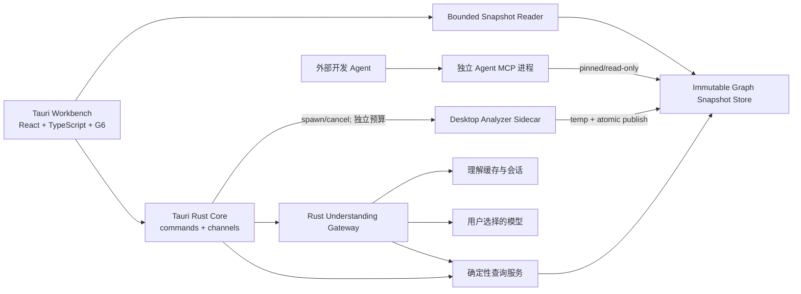

# P0 · Project Understanding Workbench（可执行版 v4 · Tauri 2）

> 日期：2026-08-05
> 状态：三轮外部 AI 复核已闭环，桌面技术栈已冻结，可按切片开工
> 原型：`webui/mockups/project-workbench-v3.html`（交互方向参考，不作为实现契约）
> 目标用户：项目 Owner、非原作者开发者、需要理解交付物的客户或管理者
> P0 交付形态：本地可运行的 Tauri 2 桌面开发构建；签名、公证、自动更新与公开安装器需另开 release gate

## 1. 问题与产品目标

AI 生成代码的速度已经超过人类理解代码的速度。用户面对快速膨胀的项目，往往无法回答：

- 这个项目现在实际包含什么？
- 某个模块、节点或调用关系为什么存在？
- 一条调用链的上游、下游和代码证据是什么？
- 如果改变某个符号或关系，哪些区域可能受影响？
- 哪些结论是静态事实，哪些只是模型解释，哪些仍然未知？

CodeLattice 的下一阶段不是生成另一份静态说明书，而是提供一个可操作的软件理解工作台：

```text
CodeLattice 负责可验证事实
模型负责按需解释和多轮取证
UI 负责选择、下钻、联动和验证
```

P0 必须同时支持两个理解入口：

1. **项目级理解**：用户不知道从哪里开始，可以直接询问项目是什么、主流程在哪里、数据经过哪里。
2. **选择级理解**：用户已经选中节点、边或链路，可以查看确定性关系，并按需让模型解释或继续追问。

## 2. 可复核的设计原则

以下原则是本轮建议基线，仍允许外部复核提出修改，不标记为“永不变更”。

| # | 原则 | 约束 |
|---|---|---|
| P1 | **事实默认可用** | 节点、边、直接上下游、位置、置信度和静态边界无需模型即可查看 |
| P2 | **解释显式触发** | 选择节点或边不会自动请求模型；翻译和 Chat 由用户主动触发 |
| P3 | **事实与解释物理分离** | 模型结果不写回事实图谱，也不写入事实 snapshot |
| P4 | **模型通过只读工具取证** | 项目级问题允许模型迭代调用受限的只读查询，而不是一次吞下整个仓库 |
| P5 | **对话即导航** | 回答必须包含可验证的证据引用和可执行的 UI 导航动作 |
| P6 | **模型解释永远不是事实** | 即使引用真实节点，模型输出仍标为“有依据的解释”；只有引擎字段显示为事实 |
| P7 | **影响分析必须有假设** | 未说明“修改谁、删除什么、改变何种契约”时，只展示依赖扩散，不直接宣称影响风险 |
| P8 | **提供商可替换且隐私透明** | 本地与远程模型统一接入，但远程发送范围必须可见、可脱敏、可取消 |
| P9 | **桌面分析不抢占 agent 服务** | 进程隔离之外，还要限制 CPU、内存、磁盘和缓存竞争，并用并发基准验收 |
| P10 | **静态事实可离线降级** | Runner 或模型服务不可用时，已加载 snapshot 的预览事实仍可浏览 |
| P11 | **桌面壳不等于分析进程** | Tauri Core 负责窗口、权限和编排；Desktop Analyzer 必须是独立 worker，不与 agent MCP 共用生命周期或可变 cache |
| P12 | **旧 Viewer 与新 Workbench 分轨** | `snapshot-viewer` 保留兼容和静态报告能力；新的 Inspector、Chat、模型池和桌面状态不得继续堆入旧单体脚本 |

## 3. 现有实现基线与差距

| 现状 | 证据 | 对 P0 的含义 |
|---|---|---|
| Web snapshot 由 Bash 调 CLI，再由 Python 聚合 | `scripts/webui-snapshot.sh`、`scripts/codelattice-snapshot-gen.py` | P0 不应预设“Rust 侧扩展 snapshot”；先在现有聚合层验证契约 |
| snapshot 图谱默认最多 150 nodes / 300 edges | `build_graph_section(... max_nodes=150, max_edges=300)` | 完整上下游链不能全部预埋进 Web snapshot，必须按需查询 |
| graph edge 当前没有稳定业务 ID | snapshot 只输出 `source/target/kind` | 必须区分语义关系身份与单次调用位置身份，不能依赖布局序号 |
| G6 adapter 当前只有 node click/double-click | `webui/snapshot-viewer/graph-g6.js` | edge click、edge selection 和 selection event contract 是 P0-A 的前置工作 |
| Runner 会为 MCP 查询启动独立子进程 | `scripts/webui-runner.py::_call_mcp_tool` | 不会占用 agent 的 stdio 会话，但仍可能竞争系统资源，不能直接等同于“互不影响” |
| Viewer 使用经典 `<script>` 加载的原生 HTML/CSS/JS；`app.js` 2042 行、`runner.js` 1346 行、`webui-runner.py` 2743 行 | `webui/snapshot-viewer/`、`scripts/webui-runner.py`（2026-08-05 实测） | 不在旧单体继续叠加产品功能；只对可复用的状态/数据契约建立基线，新桌面 Workbench 使用独立类型化边界 |
| CodeLattice 自分析曾观测到 CALLS resolution 65.7% | `AGENTS.md` 的历史质量记录 | 理解层必须展示图谱不完整性；该值是特定时间/项目的全局观测，禁止外推成任意模块解析率 |

## 4. P0 用户体验

### 4.1 Workbench 布局

```text
┌─────────────────────────────────────────────────────────────────────────────┐
│ 项目@版本 · 全局搜索/提问 · 图谱/流程/变更 · 当前模型 · 分析状态            │
├───────────┬──────────────────────────┬───────────────────┬────────────────────┤
│ 项目结构树 │ 图谱画布                  │ 事实检查器 Inspector│ Chat（可折叠/缩放） │
│ 模块/文件  │ 节点、边、局部链路、高亮   │ 上下游/证据/边界     │ 独立对话上下文       │
│           │                          │ [解释][加入对话]     │ 回答与证据 chips     │
├───────────┴──────────────────────────┴───────────────────┴────────────────────┤
│ 状态栏：snapshotId、静态分析边界、Desktop Worker、Agent MCP 并发状态         │
└─────────────────────────────────────────────────────────────────────────────┘
```

布局约束冻结如下：

- 默认四区为“结构树 | 图谱 | Inspector | Chat”；Chat 可折叠，但展开时不得覆盖或替换 Inspector。
- 窄窗口允许 Inspector/Chat 进入可固定分栏或上下分屏；只要 Chat 展开，回答与事实证据必须能同时查看。
- Inspector 永远跟随图谱当前选择；Chat 跟随自己的对话上下文，不因用户临时浏览其他节点而静默改变。
- Chat 中点击 evidence chip 会发出显式 `NavigationRequest`，更新图谱选择并让 Inspector 联动；它不是对话上下文的隐式覆盖。

状态模型必须从 P0-F 起分成两套，禁止合并成单一 `currentSelection`：

```ts
type GraphSelection =
  | { type: "none" }
  | { type: "node"; nodeId: string; snapshotId: string }
  | { type: "relation"; relationKey: string; occurrenceKey?: string; snapshotId: string }
  | { type: "chain"; chainId: string; snapshotId: string };

type ConversationContext = {
  sessionId: string;
  pinnedScope: { type: "project" | "node" | "edge" | "chain"; id: string };
  snapshotId: string;
};
```

“解释当前选择”读取动作触发时的 `GraphSelection` 快照；“加入对话”才显式更新 `ConversationContext`。snapshotId 改变时，旧对话保持 pinned 并标记 stale，不自动重绑定到新图。

### 4.2 交互状态

| 状态 | 默认展示（无模型） | 可选模型动作 |
|---|---|---|
| 未选择 | 项目统计、入口、热点、静态限制、建议问题 | “帮我认识这个项目”项目级 Chat |
| 选择节点 | 直接 callers/callees、文件位置、置信度、相关边 | 解释该节点职责；围绕节点追问 |
| 选择边 | source/target、关系类型、理由、直接上下游、证据位置 | 解释这条关系；围绕链路追问 |
| 选择链路 | 路径步骤、每步证据、缺失/低置信边 | 总结流程、指出未知和验证建议 |

### 4.3 确定性项目仪表盘

用户打开项目但尚未提出问题时，Workbench 主动展示以下事实，不触发模型：

- 已识别入口点及其静态识别理由；
- fan-in / fan-out 热点 Top-N；
- 不超过三层的模块/文件结构骨架；
- CALLS resolved / unresolved 总量与可用的全局解析率；
- macro、dynamic dispatch、cfg、external crate 等已知分析边界；
- 基于入口、热点和高置信边生成的三个“建议查看”起点。

仪表盘不得伪造模块级覆盖率。只有事实层真实产出模块级 denominator 时，才允许展示模块级解析比例。

### 4.4 影响语义

选择一条边时，默认显示的是 **dependency reach（依赖扩散）**，不是影响结论。

只有用户明确选择以下 what-if 之一，才生成影响分析：

- 修改 source 符号实现；
- 修改 target 符号签名；
- 删除当前调用关系；
- 改变返回值或错误契约。

若底层引擎不能证明某类 edge what-if，UI 必须标记为“静态假设”，不能包装成确定性事实。

## 5. 目标架构



### 5.1 冻结的桌面技术栈

| 层 | P0 决定 | 说明 |
|---|---|---|
| 桌面壳 | **Tauri 2** | 使用 Rust Core、系统 WebView、Capability 权限；不是 Electron |
| 前端工程 | **Vite + TypeScript + React** | 新 Workbench 从第一天建立类型和构建边界，不把产品功能写回旧全局脚本 |
| 图引擎 | **AntV G6（先复用现有版本）** | 先验证 edge interaction 和系统 WebView；只有基准证明不满足才另开图引擎决策 |
| UI 状态 | 显式 store/reducer | `GraphSelection` 与 `ConversationContext` 分离；不允许组件各自维护隐式副本 |
| UI↔Core | Tauri commands + channels | request/response 用 command；有序流式回答、分析进度和取消确认用 channel |
| 分析执行 | 独立 CodeLattice sidecar/worker | 不把长分析链接进 Tauri UI 主生命周期，不接管外部 agent MCP |
| 理解层 | 可测试的 Rust Gateway 模块/crate | provider、dispatcher、validator、cache、session 分模块，不新增桌面 Python runtime |
| Secret | Rust `SecretStore` 接口 + OS 安全存储实现 | 前端永远只看到 `secretRef` 和连接状态，不拿到明文 Key |

官方能力依据：

- Tauri 使用 Rust Core 与操作系统 WebView，并采用多进程模型：<https://v2.tauri.app/concept/process-model/>；
- 外部二进制可作为 sidecar 打包和受权限控制地启动：<https://v2.tauri.app/develop/sidecar/>；
- command 用于调用 Rust，channel 用于有序流式数据：<https://v2.tauri.app/develop/calling-rust/>；
- Capability/Runtime Authority 用于限制前端能调用的命令和 scope：<https://v2.tauri.app/security/runtime-authority/>。

Electron 只作为有证据的回退，不是并行实现项。若同一真实 snapshot 在 macOS WKWebView 或 Windows WebView2 上无法满足 G6 正确性、交互或内存 gate，必须停止、记录复现与指标并请用户决定；不得由实现 AI 静默切换 Electron。Wails 会额外引入 Go 后端，Flutter/Slint/纯原生会放弃现有 Web/G6 资产，均不进入 P0。

`webui/snapshot-viewer` 保留为旧静态报告/Web Runner 兼容入口。新产品目录建议为 `apps/desktop/`（Vite/React）和 `apps/desktop/src-tauri/`（薄 Tauri adapter）；共享的纯 Rust 理解业务放入 workspace crate，而不是塞进 `src-tauri/main.rs`。

### 5.2 运行边界

- **事实 Store**：只包含引擎事实和 provenance；版本不可变，完成后原子发布。
- **确定性查询服务**：根据 snapshotId 查询节点、边、上下游、片段和静态限制。
- **Understanding Gateway**：是一条由小模块组合的管道，不是继续塞进 Runner 的单个大类。
- **Tauri Rust Core**：只做窗口生命周期、Capability、transport、worker 编排和 SecretStore 桥接；不承载整个查询或模型业务单体。
- **Workbench UI**：不直接持有 API Key，不直接调用远程模型、不直接执行 shell；只消费类型化 command/channel adapter。
- **Static Snapshot Reader**：直接读取已加载的 bounded snapshot；Runner/Gateway 崩溃时仍支持仪表盘、直接关系和静态边界浏览。
- **Agent MCP sidecar**：使用自己的长生命周期进程和固定 snapshot 版本；桌面端发布新版本后不强制刷新正在进行的请求。
- **Desktop Analyzer sidecar**：只由桌面 Core 启停，拥有单独 jobId、取消令牌、线程/内存预算和临时目录；不得复用 MCP job registry。
- **兼容 Web Runner**：可以继续使用受保护的 loopback HTTP/SSE adapter，但它不是桌面主链，也不能成为事实 Store 的 gatekeeper。

UI、Tauri adapter、Web adapter 必须共享同一组序列化 DTO/schema；业务模块不得依赖 `window.__TAURI__`、HTTP URL 或硬编码本机路径。Tauri Cargo package 是否加入根 workspace，要在 P0-F 先检查 CI 的 WebKitGTK/WebView 构建条件；无条件支持前使用独立 manifest check，不能破坏现有 `cargo test`。

### 5.3 Understanding Gateway 管道

```text
Transport Adapter   — Tauri commands/channels；兼容 Web Runner 使用 SSE/HTTP
Session Manager     — sessionId、上下文、历史 trace、取消状态
Tool Dispatcher     — 只读工具 schema、轮次/字节/token 预算、结果截断
Model Adapter       — Ollama / OpenAI-compatible 统一流式接口
Output Validator    — claim schema、evidenceRef、navigationAction 白名单
Cache Manager       — 独立 schema、evidenceHash 缓存与精确失效
```

Gateway 业务逻辑必须放入独立、可测试的 Rust crate/module，建议名为 `crates/understanding-gateway/`；Tauri Core 只注册 commands/channels，`webui-runner.py` 只保留旧 Web 兼容编排。禁止把 Gateway 继续追加到 `webui-runner.py`，也禁止把它整体搬成另一个 Rust 大文件。

Tool Dispatcher 默认遵循逐层取证预算：

```text
Level 1：project_summary / search_nodes
Level 2：get_node_context / get_edge_evidence
Level 3：get_call_chain / get_source_excerpt
```

P0 默认预算冻结为保守起点：

| 层级 | 默认工具 | maxCalls | maxReturnBytes / call | 附加限制 |
|---|---|---:|---:|---|
| Level 1 | `project_summary` / `search_nodes` | 3 | 8 KiB | 优先定位，不返回源码正文 |
| Level 2 | `get_node_context` / `get_edge_evidence` | 5 | 16 KiB | 返回局部结构和证据引用 |
| Level 3 | `get_call_chain` / `get_source_excerpt` | 4 | 32 KiB | `maxSourceLines=50` |
| 会话总计 | 所有工具 | 12 | — | `maxEvidenceTokens=16,384`，达到上限后停止取证并提示用户 |

模型可以申请跳级，但必须在 trace 中记录理由。预算由 Gateway 强制执行，不接受模型自行放宽；模型 profile 可以调低，本地高级设置可以显式调高，但必须同时受全局硬上限和 UI 发送预览约束。返回超限时做结构化截断并标记 `truncated=true`，不能静默截断。

## 6. 数据与接口契约

### 6.1 事实 snapshot

继续使用 `webui.snapshot.v1`，只增加向后兼容的事实字段，不增加模型生成的 `understanding` section。

边身份拆成两个层级，避免把“逻辑关系”与“某个调用位置”混为一谈：

```jsonc
{
  "relationKey": "rel:sha256:...",
  "occurrenceKey": "occ:sha256:... | null",
  "source": "sym:a",
  "target": "sym:b",
  "kind": "calls",
  "confidence": 0.92,
  "reason": "direct-path-match"
}
```

推荐初始规则：

```text
relationKey = sha256(sourceId + kind + targetId)
occurrenceKey = sha256(relationKey + verifiedCallSiteDesignation)
```

- `relationKey` 表示语义关系，用于关系级解释、best-effort 跨 snapshot diff 和无平行边场景。
- `occurrenceKey` 表示具体调用位置，只在事实层真实提供稳定 call-site designation 时生成。
- byte offset 会随前文编辑漂移；排序序号会随插入/重排漂移，二者都不能被描述成跨版本稳定身份。
- 若当前语言 adapter 没有 call-site span/designation，P0 先把 UI 建模为 relation-level，不得从行号或数组序号伪造 occurrence identity。
- Rust byte span、Python `col_offset`、TS/ArkTS `pos` 等候选必须先验证原始图是否真实携带，再通过平行边与重分析 fixture 冻结。
- 跨 snapshot 定位明确是 best-effort；同一 snapshot 内重载和布局变化必须稳定。

### 6.2 按需证据包

证据包不为所有边预生成，由查询服务在用户选择后按需返回：

```jsonc
{
  "schemaVersion": "codelattice.edgeEvidence.v1",
  "snapshotId": "snap:...",
  "selection": {
    "relationKey": "rel:...",
    "occurrenceKey": null,
    "sourceId": "sym:a",
    "targetId": "sym:b",
    "kind": "calls"
  },
  "directUpstream": [],
  "directDownstream": [],
  "dependencyReach": [],
  "sourceRefs": [
    {"id": "src:...", "file": "src/main.rs", "startLine": 41, "endLine": 45}
  ],
  "limitations": [
    {"id": "limit:macro", "text": "macro expansion not performed"}
  ],
  "coverageContext": {
    "scope": "project",
    "resolvedCalls": 2338,
    "totalCalls": 3557,
    "resolutionRate": 0.657,
    "knownIncomplete": true,
    "caveatRef": "coverage:project:calls"
  },
  "generatedFrom": {
    "staticAnalysis": true,
    "runtimeVerified": false,
    "coverageVerified": false
  }
}
```

上述数字只用于 schema 示例，实际值必须来自当前 snapshot 的事实统计。若不存在某模块的 `resolved/total` denominator，则 `scope` 只能是 project，不能由 UI 或模型推算模块覆盖率。

P0 查询接口建议：

```text
GET /api/graph/snapshots/{snapshotId}/relations/{relationKey}
GET /api/graph/snapshots/{snapshotId}/nodes/{nodeId}
GET /api/graph/snapshots/{snapshotId}/nodes/{nodeId}/neighbors?direction=&depth=
GET /api/graph/snapshots/{snapshotId}/nodes/{nodeId}/call-chains?direction=&depth=
GET /api/graph/snapshots/{snapshotId}/source/{sourceRef}
```

后端究竟复用 MCP persistent cache，还是建立专用 immutable query store，必须在 P0-A preflight 中以延迟、内存、并发隔离证据选择，不能先拍板。

### 6.3 模型输出

模型输出与事实对象分离：

```jsonc
{
  "schemaVersion": "codelattice.understandingAnswer.v1",
  "scope": {"type": "project|node|edge|chain", "id": "..."},
  "answerSummary": "...",
  "claims": [
    {
      "id": "claim:1",
      "text": "...",
      "classification": "grounded_interpretation|hypothesis|unknown",
      "evidenceRefs": ["rel:...", "src:...", "limit:..."],
      "coverageCaveatRefs": ["coverage:project:calls"]
    }
  ],
  "navigationActions": [
    {"type": "focusRelation", "relationKey": "rel:..."}
  ]
}
```

结构校验只能证明引用 ID 存在，不能证明自然语言与证据在语义上完全蕴含。因此：

- 引擎字段显示为“事实”；
- 有有效引用的模型断言显示为“有依据的解释”；
- 无引用或引用不完整的断言强制显示为“假设”；
- 模型明确无法回答的内容显示为“未知”；
- 模型输出永不升级或补写图谱事实。

`coverageCaveatRefs` 由 Gateway 根据证据包补充，不要求模型生成。用户查看调用结论时，UI 至少显示项目级覆盖边界；只有事实层存在更细 denominator 时才缩小 scope。

P0 不引入第二个模型做 entailment。可以增加廉价的 identifier vocabulary 检查：模型以反引号、symbol chip 或 navigationAction 声称存在的代码标识必须出现在证据词表；未匹配时降级为假设。普通自然语言不做词法强约束，避免把同义表达误判为幻觉。

### 6.4 Chat 的只读工具集合

项目级 Chat 可迭代调用以下能力，但不允许执行任意 shell 或修改项目：

```text
project_summary
search_nodes
get_node_context
get_edge_evidence
get_call_chain
get_source_excerpt
get_static_limitations
get_change_impact（必须携带明确 what-if）
```

每轮工具调用要写入会话 trace，用户可以展开查看模型查询了哪些证据。

### 6.5 理解缓存

模型结果写入独立缓存，不修改 snapshot：

```text
cacheKey = hash(
  evidenceHash + modelProvider + modelId + modelRevision +
  promptVersion + locale + explanationLevel
)
```

snapshot 更新后，只有 `evidenceHash` 变化的解释失效，不按整仓无差别清空。

理解缓存使用独立 `schemaVersion`，必须支持整体删除、零事实副作用和完全重建；删除模型配置时可以清理关联缓存，但不得触碰事实 Store。

## 7. 模型池与安全边界

### 7.1 配置

`~/.codelattice/models.json` 只保存非敏感配置和 secret reference：

```jsonc
{
  "default": "qwen-local",
  "models": [
    {
      "id": "qwen-local",
      "provider": "ollama",
      "baseUrl": "http://127.0.0.1:11434/v1",
      "model": "qwen3:14b"
    },
    {
      "id": "remote-compatible",
      "provider": "openai-compatible",
      "baseUrl": "https://provider.example/v1",
      "model": "model-id",
      "apiKeyRef": "keychain:codelattice/remote-compatible"
    }
  ]
}
```

### 7.2 安全规则

- Key 不进入 snapshot、理解缓存、浏览器 localStorage、日志或模型 prompt。
- 前端 WebView 不直接持有 Key；新增/更新 Key 通过受 Capability 限制的 Tauri command 写入 `SecretStore`，前端返回值只能是 secretRef、掩码和连接状态。
- 远程调用统一经 Rust Gateway；模型请求日志必须在写盘前删除认证 header 和明文 Key。
- 远程模型调用时，API Key 和用户确认的证据会发送给所选提供商，不能宣称“完全不出本机”。
- 本地 Ollama 才能显示“项目证据不离开本机”。
- 远程模型默认只发送结构化图证据；绝对路径默认按现有 `redact_root` 规则脱敏。
- 每次新增代码片段发送范围时都需要显式确认；显示 provider、文件数、字符数和片段范围，并允许继续脱敏或取消。
- 源码、注释和文档一律视为不可信输入；不得允许其中的 prompt injection 扩大工具权限或读取额外文件。
- 模型工具只读、参数受 schema 限制、返回长度受预算限制。
- Tauri Capability 默认拒绝 shell、任意文件系统和任意网络调用；只允许白名单 commands、已声明的 analyzer sidecar 及用户选定的项目根。

P0 模型池只支持：Ollama、一个通用 OpenAI-compatible adapter、连接测试、增删、设默认。计费统计、embedding 模型和模型市场均后置。

若兼容 Web Runner 采用 loopback HTTP，必须绑定 `127.0.0.1`、使用随机 session token，并校验 Origin；这只是旧 Web 宿主的 transport 实现，不进入 UI/Gateway 业务接口契约。Tauri 主链使用 commands/channels，不为方便而额外暴露本地监听端口。

## 8. Desktop Analyzer 与 Agent MCP 隔离

仅仅“两个进程”不足以证明互不影响。P0 的进程所有权冻结为：外部开发工具拥有 Agent MCP；Tauri Core 只拥有 Desktop Analyzer；二者都不能终止、复用或注入对方的 stdio/job registry。P0 必须实现或验证：

1. Desktop analyzer 和 agent MCP 不共享可变的进程内 cache。
2. Desktop analyzer 使用独立临时写路径；完整 snapshot 通过 atomic rename 发布。
3. Agent 请求固定读取启动时或请求开始时选定的 snapshotId，不在请求中途切换版本。
4. Desktop 同一时刻最多运行一个重分析任务，支持取消。
5. Desktop 分析使用较低资源优先级或显式线程预算；agent 查询优先。
6. 若事实 Store 需要清理，不能删除被活跃 MCP 会话 pinned 的版本。
7. OS `nice`、线程数和取消策略封装在 scheduler interface 后，不把 macOS/Linux 细节写入 UI 或 Gateway。
8. Runner/Gateway 不可用时，已加载 snapshot 的 bounded 事实继续可读；只有完整链路、重新分析和模型能力降级。
9. Workbench 默认只保留当前 snapshot 和一个上一版本引用；额外版本按未 pinned 优先清理，避免 UI 长期持有整图导致内存单调增长。
10. 记录 Tauri Core、WebView、Desktop Analyzer 和 Agent MCP 各进程以及聚合 RSS/峰值；不得只看单个进程得出“内存已优化”。

并发验收场景：

- 启动一个长生命周期 agent MCP sidecar；
- 同时由 Desktop Analyzer 生成新 snapshot；
- 固定频率查询 symbol/context/call-chain；
- 要求无 EOF、busy、协议错误和错误版本混读；
- 在固定 fixture 上记录基线与并发 P95，目标退化不超过 30%（阈值由 preflight 基准复核）。
- 连续执行 20 次“打开项目 → 选择链路 → 打开/关闭 Chat → 切换 snapshot”循环，等待相同静置窗口后聚合 RSS 不得持续单调增长；数值内存预算必须在 P0-F0/F1 基线阶段写回本卡后再进入 P0-A。

## 9. P0 范围与执行切片

### P0-F0 · Baseline 与契约字符化（功能前置）

本切片不增加用户功能，也不尝试为 2042 行旧脚本补齐“所有历史行为”的测试。characterization 范围冻结为：

**自动化覆盖：**

- 同一 fixture 的 snapshot JSON 结构、截断标记和关键计数；
- 给定 node/edge/chain 输入后的纯 selection transition 与预期高亮集合；
- graph adapter 发出的 node/edge interaction event payload；
- evidence/query client 的请求 DTO、返回 DTO、错误和静态 fallback；
- 旧 Viewer 的现有 snapshot smoke 页面能打开、切换主要视图且无 uncaught error。

**明确不做自动 characterization：**

- G6 具体布局坐标、动画时序和 Canvas 像素级视觉；
- CSS 像素等价、字体渲染和旧页面全部交互组合。

上述视觉项使用固定 fixture、截图和人工 smoke checklist；不得把 P0-F0 扩成无边界的视觉回归工程。先记录旧 Viewer、Web Runner、同一 snapshot 的响应时间和聚合内存基线，并把数值预算写回 §11，再进入新桌面功能。

### P0-F1 · Tauri 桌面地基与模块边界

1. 新建 `apps/desktop/`：Tauri 2 + Vite + TypeScript + React；以现有 mockup 为交互参考，不复制手写数据。
2. 前端至少建立 `state/graph-selection`、`state/conversation`、`graph/graph-controller`、`data/snapshot-reader`、`data/evidence-client`、`panels/dashboard`、`panels/inspector`、`panels/chat` 模块；组件不能直接调用 Tauri 全局对象。
3. 建立类型化 `DesktopTransport` 接口；生产实现使用 Tauri commands/channels，测试实现使用 in-memory fake，兼容 Web adapter 另行实现。
4. 建立独立、纯 Rust 的 Understanding Gateway crate 骨架：service、provider、tool dispatcher、validator、cache、session、secret store 接口；薄 Tauri adapter 只做命令注册和流式桥接。
5. 建立 Desktop Analyzer worker supervisor：spawn、单任务、进度、取消、退出清理和临时目录；不得导入或控制 Agent MCP 的 job registry。
6. 旧 `snapshot-viewer` 不做全量 React/TypeScript 重写；只有可证明复用价值的纯状态/DTO 逻辑可以先抽成 ES Module，再迁移到类型化新 Workbench。禁止在旧 `app.js`、`runner.js` 新增 Chat/模型池/双状态业务。
7. 先用真实 bounded snapshot 完成 macOS WKWebView 的 G6 node/edge click、resize、重复 mount/unmount smoke；Windows WebView2 在具备环境时执行。失败触发 stop-line，不静默切 Electron。

### P0-A · Fact Workbench

P0-A 分为可并行的两条轨道；Track B 不占 Track A 前五步的关键路径，但必须在 A6 开工前完成并冻结结论。

**Track A · 前端事实交互与契约**

1. 冻结 nodeId、relationKey、可选 occurrenceKey 和 sourceRef 契约。
2. 给新 Workbench 的 G6 adapter 增加 edge click、edge hover、selection event contract。
3. 实现独立 `GraphSelectionStore` 与 `ConversationStore`；树、画布和 Inspector 只订阅前者，Chat 显式 pin 后订阅后者。
4. 实现确定性项目仪表盘：入口、热点、结构骨架、覆盖上下文、边界和建议起点。
5. 保留纯 bounded snapshot 静态读取路径；直接关系和仪表盘不依赖 Gateway/worker 存活。
6. 在 Track B 结论冻结后实现按需完整证据查询，不把所有调用链复制进 snapshot。
7. Inspector 展示真实直接上下游、coverageContext、证据和静态边界。
8. 用平行边 Rust fixture、一个非 Rust fixture 和 CodeLattice 自身受控 snapshot 验证真实数据。

**Track B · Query-store spike（与 Track A 1–5 并行）**

1. 比较长生命周期 MCP facade、full immutable graph index、SQLite query store 三个候选。
2. 在同一 fixtures 和 CodeLattice 受控 snapshot 上记录冷/热 P50/P95、首屏读取、两跳链路、内存、磁盘、启动时间、并发读和 Desktop 发布新 snapshot 时的 Agent MCP 退化。
3. 把原始命令、机器/构建信息、结果和选型理由写入本卡；禁止凭架构偏好选型。
4. 合流 gate：未得出数据源、内存上限、查询延迟和 snapshot pin 方案前，不得开始 Track A6 或模型工具循环。

### P0-B1 · Selection Translation

1. 本地 Understanding Gateway 最小 service + provider adapter。
2. Ollama + OpenAI-compatible 最小模型池。
3. 单次“解释当前选择”：输入冻结 evidence bundle，不允许模型工具循环。
4. 支持 streaming、取消、重试、独立缓存、claim-level chips 和 navigationActions。
5. 实现远程发送预览、默认路径脱敏、代码片段二次确认和 secret storage。
6. 模型失败时完整保留 Fact Workbench。

### P0-B2 · Evidence-grounded Chat

1. 项目级 Chat 与选择级 Chat，共用只读 Tool Dispatcher。
2. 实现分级取证预算、最大工具轮数、结果截断和用户可展开 session trace。
3. 回答复用 claim-level validation、coverage caveat 和导航联动。
4. 支持会话取消、重连、模型切换和上下文预算耗尽提示。
5. 验证“用户不知道问什么”时可以从确定性仪表盘建议进入 Chat，而不是从空白 prompt 开始。

### P0-C · Isolation Closure

1. immutable snapshot publish / pin / cleanup 规则。
2. Desktop analyzer 资源预算和取消。
3. Agent MCP + Desktop Analyzer 并发基准。
4. 完整 Desktop Workbench smoke、旧 Viewer 回归、模型失败降级、离线模式和安全回归。

### P0-D · Desktop Integration Closure

1. 完成 Tauri commands/channels、Capability allowlist、CSP、项目根 scope 和 sidecar 参数白名单。
2. 完成本机 `tauri dev` 与本地非商业 build；验证 Analyzer 缺失、模型不可用、snapshot 损坏和 Core 重启的降级提示。
3. 运行 G6 重复 mount、Chat streaming/cancel、snapshot 切换和 20 轮内存回归；按进程记录聚合指标。
4. 更新用户文档：首次打开、选择项目、事实/解释标识、模型池、隐私预览、缓存清理和 Agent MCP 并发说明。
5. 运行仓库 native precommit；只有所有 stop-line 与验收通过，才允许按 AGENTS.md commit/push。公开安装器、签名、公证和 updater 不在本切片执行。

## 10. 明确不纳入 P0

- 自动生成完整产品能力地图；
- 离线批量翻译所有节点或边；
- 流程播放器的自动产品化归纳；
- snapshot 跨版本能力 diff 和自动变更叙述；
- Electron/Wails/Flutter/Slint 并行实现或静默回退；
- 商业发行、公开安装器、签名、公证和自动更新；
- embedding 模型、向量库和语义搜索替换；
- 模型市场、用量计费和团队云同步；
- arbitrary shell、代码执行或模型写回图谱；
- 强制 AI 变更回执；
- 多项目 workspace 理解会话。

## 11. 验收标准

### 11.1 事实与交互

1. 点击真实 CALLS edge 后，100ms 内先显示 snapshot 中已有的直接关系；需要完整链路时异步加载，不阻塞画布。
2. 选择节点、边本身不会产生任何网络或模型请求，可由测试计数器证明。
3. 同一 snapshot 重载、重复布局后 `relationKey` 保持稳定；有真实 call-site designation 时，平行边的 `occurrenceKey` 唯一。
4. 跨 snapshot 关系定位明确标记 best-effort，不把 byte offset 或排序序号包装成永久身份。
5. snapshot 未包含的完整链路由按需查询返回，UI 明确区分“预览”与“完整查询”。
6. 未选择状态展示确定性仪表盘，包括入口、热点、结构骨架、覆盖上下文、边界和建议起点。
7. Runner/Gateway 停止后，已加载 snapshot 的仪表盘、节点、直接关系和静态限制仍可浏览。
8. CALLS 结论显示事实层 `coverageContext`；不存在模块 denominator 时不得展示模块解析率。
9. 用户在 Chat 讨论节点 B 时可以选择图谱节点 A，Inspector 切到 A 而 `ConversationContext` 仍 pinned 到 B；只有“加入对话”动作才改变 pinned scope。
10. evidence chip 产生可审计 `NavigationRequest` 并更新图谱/Inspector；非法或跨 snapshot 未确认的导航被拒绝或显示 stale 提示。

### 11.2 模型理解

11. P0-B1 点击“解释当前选择”后，每条模型 claim 均按规则显示为有依据解释、假设或未知，且不启动工具循环。
12. 点击 evidence chip 能定位节点、关系或源码位置；非法引用和越权 navigationAction 被拒绝。
13. 模型声明的代码 identifier 若不在证据词表中则降级为假设；普通自然语言不做强词法限制。
14. P0-B2 项目级问题至少通过一个只读工具取证，回答不得只依赖模型先验。
15. Tool Dispatcher 默认严格执行 L1 `3×8KiB`、L2 `5×16KiB`、L3 `4×32KiB/50 lines`、总调用 12 和 evidence 16K tokens；超限停止且 trace 明示，不静默丢证据。
16. 切换模型不会改变事实 snapshot、节点、边、置信度、coverageContext 或静态限制。
17. 模型不可用、超时、JSON 无效或用户取消时，事实检查器仍完整可用。

### 11.3 模型池与隐私

18. API Key 不出现在 snapshot、缓存、日志、前端状态、command 返回值和错误信息中。
19. 远程模型默认只发送结构化证据；新增代码片段发送范围必须获得用户确认，路径默认脱敏。
20. 相同 evidence/model/prompt 命中缓存；证据改变后精确失效。
21. 删除整个理解缓存后事实功能零变化，并可从 snapshot 和模型重新生成。

### 11.4 进程隔离

22. Desktop 分析期间 agent MCP 查询无 busy、EOF、协议错误和版本混读。
23. 受控 fixture 并发 P95 相对基线退化目标不超过 30%，同时记录 CPU、峰值内存和磁盘写入。
24. Desktop 取消或崩溃不会留下可被 agent 读取的半写 snapshot。

### 11.5 Tauri、兼容性与内存

25. `apps/desktop` 可在当前 macOS 开发环境启动，打开真实 snapshot，完成 node/edge selection、Inspector、Chat streaming/cancel 和 worker 取消；前端无 uncaught error。
26. G6 在 WKWebView 上完成重复 mount/unmount、窗口 resize 和 20 轮选择测试；具备 Windows 环境时补 WebView2 smoke，缺少环境必须如实记录而非声称通过。
27. 前端不能调用未列入 Capability 的 shell、文件路径或模型命令；Analyzer sidecar 名称和参数均通过白名单验证。
28. F0 先记录旧 Viewer 参考值，F1 再用同一 fixture、同一 release/debug 口径和固定静置窗口建立 Tauri 初始基线并冻结下表预算；预算数值未冻结前 P0-A 不得开工：

| 场景 | 进程范围 | 基线 | P0 预算 | 最终结果 |
|---|---|---:|---:|---:|
| 旧 Viewer bounded snapshot 静置 60s（参考） | Browser + Web Runner | F0 实测：Runner 39MB + Chrome 4414MB 聚合 4452MB（加载后 4613MB，静置 -3.5%）；API P50/P95：list 0.87/3.46ms，get 0.49/1.49ms；fixture=rust-portable-smoke | 参考项，不直接作为 PASS/FAIL | 待测 |
| 空 Workbench 静置 60s | Tauri Core + WebView | F1 初始壳实测 | 最终不高于初始壳的 1.25 倍 | 待测 |
| bounded snapshot 打开后静置 60s | Core + WebView | F1 事实读取实测 | 最终不高于事实读取基线的 1.25 倍 | 待测 |
| Desktop analyze 峰值 | Core + WebView + Worker | F1 worker spike 实测 | 由 F1 按项目规模冻结，必须显式数值 | 待测 |
| 20 轮交互后静置 60s | Core + WebView | 第 1 轮 | 不高于第 1 轮静置值的 1.15 倍 | 待测 |

29. 旧 `snapshot-viewer` 的 smoke 继续通过；新功能没有新增到 `app.js`、`runner.js` 或 `webui-runner.py` 单体中。
30. P0 只产出本地开发/非商业 build；不存在未过 release gate 的公开安装器、自动更新端点或市场分发。

## 12. 初始 Write Set / Forbidden Set

### 12.1 预期 Write Set

- `docs/webui/`：事实、证据、模型回答、Gateway 和隔离契约；
- `docs/plans/2026-08-05-project-understanding-p0.md`：执行卡和 closure；
- `apps/desktop/`：Tauri 2 + Vite + TypeScript + React Workbench、类型化 state/data/graph/panel 模块与前端测试；
- `apps/desktop/src-tauri/`：薄 commands/channels、Capability、CSP、SecretStore bridge 和 Desktop Analyzer supervisor；
- `crates/understanding-gateway/`（建议名）：provider、tool dispatcher、validator、cache、session 与 DTO；
- 根 `Cargo.toml` / lockfile：仅在 preflight 证明不会破坏现有跨平台检查后加入新 Rust crate；Tauri shell 可先用独立 manifest check；
- `scripts/codelattice-snapshot-gen.py`：relationKey、可选 occurrenceKey、coverageContext 与轻量事实字段；
- `scripts/webui-runner.py`：仅限旧 Web 兼容 transport/编排所需的小改动，不承载 Gateway 业务；
- `webui/snapshot-viewer/`：仅限 characterization seam、兼容 adapter 和旧 viewer smoke；不加入 Chat/模型池新产品功能；
- query store 相关 crate/module：只有 P0-A Track B 选型证据通过后才能加入 Write Set；
- `scripts/webui-*-smoke.sh`、desktop smoke、fixtures：契约、隐私、并发、内存和降级测试。

除已冻结的 Understanding Gateway crate 外，是否新增或修改 query-store/分析相关 Rust crates 必须由 P0-A Track B 选型决定，不能因为原计划写了“Rust 侧”就默认扩大范围。

### 12.2 Forbidden Set

- 不修改 CALLS/IMPORTS 图谱语义和 confidence/reason；
- 不让模型补图、改边或把解释写成事实；
- 不执行被分析目标项目的代码、build.rs、package manager 或 arbitrary shell；CodeLattice 自有前端依赖安装只能使用锁文件和受审依赖；
- 不把 API Key 放入 JSON 配置明文、snapshot、localStorage 或日志；
- 不让 Desktop analyzer 复用或终止 agent 的 MCP 进程；
- 不把 Gateway 业务堆入 `src-tauri/main.rs`、`app.js`、`runner.js` 或 `webui-runner.py`；
- 不在 P0 顺带实现 capability map、snapshot diff、商业安装器、自动更新或 embedding；
- 不静默加入 Electron 或同时维护两套桌面壳；
- 不以 mockup 的手写节点、风险和文案作为真实数据验收。

## 13. 开工前 Stop-lines

任一条件未满足时，不进入模型 UI 实现：

1. relationKey / occurrenceKey 没有多语言 fixture、平行边和重分析测试；
2. 完整链路数据来源、内存上限和查询延迟没有证据；
3. 模型输出 schema 未定义 claim-level provenance 与导航校验；
4. 远程证据发送和 secret storage 边界未冻结；
5. Desktop/agent 并发基线未测；
6. P0-F0 的状态/数据 characterization tests 未通过，或试图把 G6 坐标、动画、CSS 全部纳入自动字符化导致范围失控；
7. 新状态继续堆入 `app.js` / `runner.js` / `webui-runner.py`，或 Gateway/Tauri commands 形成新的大单体；
8. `GraphSelection` 与 `ConversationContext` 没有独立 store、显式 pin/navigation 测试；
9. Tauri WKWebView 的真实 G6 edge click、resize、重复 mount/unmount smoke 未过；不得静默改用 Electron；
10. Tauri Capability、SecretStore 和 sidecar 参数白名单未冻结；
11. F0/F1 尚未写入数值内存预算，或只测单一进程而没有聚合 Core/WebView/Worker；
12. 根 workspace/CI 不能构建 Tauri 依赖却仍把 shell 无条件加入默认 `cargo test`。

## 14. 阶段 Gate 与证据回写

本卡已经可以开工，但以下数据型决策不能靠实现者猜测。每个 gate 通过时，必须把命令、环境、原始指标、结论和剩余限制追加到本卡；没有证据不得把状态写为完成。

| Gate | 进入条件 | 通过条件 | 阻塞的后续工作 |
|---|---|---|---|
| G0 · Baseline | F0 fixtures 固定 | 状态/数据 characterization、旧 Viewer smoke、旧基线和测试边界有记录 | 全部实现 |
| G1 · Desktop Ground | Tauri/Vite/TS/React skeleton 可启动 | WKWebView G6 smoke、Capability 默认拒绝、双 store 测试、F1 内存预算写回 | P0-A |
| G2 · Identity | relation/occurrence 候选已取样 | Rust 平行边 + 非 Rust + 重分析 fixture 通过，稳定范围被如实声明 | edge Inspector/B1 |
| G3 · Query Store | 三候选基准完成 | 选型、内存上限、P95、pin/publish 方案写回 | 完整链路与 B2 工具循环 |
| G4 · Model Safety | SecretStore、发送预览和 validator 测试完成 | Key 零泄漏、越权 action 被拒绝、代码片段需确认 | 远程模型与 B2 |
| G5 · Isolation | Agent MCP 与 Desktop Worker 可并行 | 无协议/版本混读，P95 默认退化 ≤30%，取消无半写 snapshot | P0-D closure |
| G6 · Closure | 1–30 验收项有结果 | native precommit 全过；未测平台和剩余限制已列明 | commit/push |

若某 gate 因当前环境无法验证 Windows、签名或外部模型，不得伪造 PASS。与 P0 主功能无关的跨平台项可以记录为“环境未覆盖”；涉及事实正确性、secret 泄漏、agent 会话安全或当前 macOS 主路径的项目必须停止并向用户报告。

## 15. 实现时以证据收敛的决策

以下项目不再交给泛化复核，而由对应 spike 在任务内收敛：

- 完整图查询数据源：长生命周期 MCP facade、full immutable graph index 或 SQLite query store；由 G3 决定。
- occurrenceKey 的跨语言 verified call-site designation；无可靠 designation 的语言只保留 relation-level，由 G2 决定。
- 数值内存预算：按 F0 旧基线与 F1 Tauri spike 写回 §11.5；不得用“看起来不高”代替数字。
- concurrent P95 默认阈值为 30%；若当前机器噪声使结果不可复现，只能补充采样和置信区间，不能擅自放宽。
- 理解缓存保留：P0 至少实现手动整体清理、按 evidenceHash 精确失效和模型删除后的关联清理；自动保留天数/容量上限可在测得实际条目大小后冻结。
- Windows WebView2：有可用环境则作为 G1；无环境则明确列为 release 前未覆盖项，不阻塞当前 macOS 本地开发构建。

已冻结、不再开放：Tauri 2、Vite + TypeScript + React、G6 初始复用、Rust Gateway、双状态 store、Tool Dispatcher 默认预算、旧 Viewer/新 Workbench 分轨，以及“模型不写回事实层”。

## 16. 三轮复核闭环记录

### 16.1 已直接采纳

- 模块化地基提升为 P0-F，不再只是 stop-line；
- 确定性项目仪表盘进入 P0-A 与验收；
- Gateway 明确为分层管道，并从 Runner 大文件中物理拆出；
- snapshot 静态读取作为 Runner 崩溃时的事实降级路径；
- P0-B 拆成单次选择解释 B1 与多轮工具 Chat B2；
- 理解缓存整体可删、零事实副作用、可完全重建；
- 远程模型默认结构化证据、路径默认脱敏、代码片段二次确认。

### 16.2 调整后采纳

- **覆盖率**：采纳 coverage caveat，但不把 CodeLattice 自分析的全局 65.7% 外推为模块解析率；由事实层提供 `coverageContext`，没有 denominator 就不显示比例。
- **边身份**：不直接冻结 byte span 或排序序号；改为 relationKey + 可选 occurrenceKey，两者稳定性范围分别声明。
- **查询层**：专用只读 store 是强候选，但仍以 MCP/full graph/SQLite 三方 spike 决策，避免未测先定。
- **词法校验**：只约束明确声明的代码 identifier 和导航目标，不约束普通自然语言同义表达。
- **桌面 transport**：Tauri 主链冻结为 commands/channels；兼容 Web Runner 可以保留 HTTP/SSE adapter，二者共享 DTO/schema 而不是共享 transport。

### 16.3 明确未原样采纳的提案

- 不使用 `filePath + byte offset` 宣称跨版本 edge 稳定；前文编辑会导致 offset 漂移。
- 不使用“按 file+line 排序后的第 N 条边”宣称跨版本稳定；插入、删除和重排会改变序号。
- 不把“有 evidenceRef”视为模型断言已被语义证明；P0 只能验证结构引用和有限 identifier 词表。
- 不承诺“进程分开即互不影响”；仍需资源调度、immutable publish 和并发 P95 证据。

### 16.4 第三轮复核与 Tauri 2 决策

**直接采纳：**

- characterization 自动测试只覆盖状态逻辑、数据流、DTO 和基础 smoke；G6 布局/动画/CSS 采用人工回归；
- query-store spike 与前端事实轨并行，结论只在完整证据查询前合流；
- Inspector 与 Chat 同时可见，`GraphSelection` 和 `ConversationContext` 从地基阶段分离；
- Tool Dispatcher 使用 L1/L2/L3 和会话总预算的明确默认值。

**调整后采纳：**

- 未把“原生 ES Modules、无 bundler、无 TypeScript”冻结为整个 P0 的目标。该方案只允许作为旧 Viewer 提取纯逻辑的短期过渡；新桌面 Workbench 直接使用 Vite + TypeScript + React，避免把一个无类型单体变成多个无类型文件。
- 未要求先把旧 `app.js` 全量拆到 500 行以内。Tauri 选择后，更低风险的路径是冻结旧 Viewer 的新增范围，新产品在独立类型化目录实现，仅复用已验证的事实契约和纯逻辑。

**新增架构决定：**

- 桌面壳选 Tauri 2；Electron 只在真实 WebView/G6 gate 失败后由用户决定是否回退；
- Gateway 目标实现改为纯 Rust crate，避免桌面发行新增 Python runtime；
- P0 交付本地开发/非商业桌面 build，商业签名、公证、自动更新和公开安装器继续受独立 release gate 约束。

## 17. 长任务 / 目标模式执行提示词

将下列提示词原样交给实现 AI；它必须以本卡和仓库 `AGENTS.md` 为准，不需要重新发散产品方向：

```text
你现在位于 /Users/jiangxuanyang/Desktop/codelattice。请以“长任务/目标模式”持续完成 CodeLattice Project Understanding Workbench P0，直到 execution card 的可执行范围真正完成，不要只做脚手架、mockup 或半成品。

唯一目标：严格实施 docs/plans/2026-08-05-project-understanding-p0.md 的 v4 Tauri 2 方案，交付一个基于真实 CodeLattice snapshot/查询数据的本地桌面 Workbench：事实默认可用，模型解释显式触发，项目级/选择级 Chat 可通过只读工具取证，且 Desktop Analyzer 不干扰外部 Agent MCP。

工作规则：
1. 首先完整阅读 AGENTS.md 和 execution card；检查 git status，保护已有/未跟踪用户文件，不做 destructive git 操作。
2. 这是实现任务，不是再次做产品脑暴。已冻结：Tauri 2、Vite + TypeScript + React、G6 初始复用、Rust Understanding Gateway、GraphSelection/ConversationContext 双 store、Tool Dispatcher 默认预算、旧 Viewer/新 Workbench 分轨、事实与模型输出物理分离。
3. 先执行 CodeLattice-native impact/preflight，按 AGENTS.md 报风险和 blast radius；重要符号高/critical 风险时，在 commit/push 前必须警告用户。
4. 使用持久计划文件记录进度。按 P0-F0 → P0-F1 → P0-A（Track A 与 Track B 可并行，G3 前合流）→ P0-B1 → P0-B2 → P0-C → P0-D 执行。每个 gate 都把命令、环境、指标、结论和限制回写 execution card。
5. 对每个功能/bugfix先建立失败测试或 characterization seam，再实现最小改动；自动 characterization 只覆盖状态、数据流、DTO 和基础 smoke，不把 G6 坐标、动画、CSS 扩成无限视觉测试。
6. 新产品代码进入 apps/desktop 和独立 Rust crate；不要把 Chat、模型池、Gateway 或新状态继续堆入 webui/snapshot-viewer/app.js、runner.js、scripts/webui-runner.py 或 src-tauri/main.rs。
7. Tauri Core 只做 Capability、commands/channels、SecretStore bridge 和 worker 编排。Desktop Analyzer 是独立 sidecar/worker；绝不复用、终止或污染外部 Agent MCP 进程/job registry。共享数据只能通过版本化 immutable snapshot、temp + atomic publish 和 snapshot pin。
8. 所有 UI 数据必须来自真实 snapshot/fixture/查询；mockup 手写节点、风险、行号和文案不能作为实现或验收数据。静态分析不是运行时/测试覆盖证明。
9. 模型只能通过白名单只读工具访问事实。Key 不得进入前端状态、localStorage、snapshot、缓存、日志、prompt 或 command 返回值。远程模型默认只发脱敏结构化证据，代码片段必须二次确认。
10. 不要静默切换 Electron、图引擎或 Gateway 语言。如果 WKWebView/G6、query-store、secret 或 agent 并发触发 stop-line，记录完整证据并向用户报告后等待决定。
11. 不修改 live repos、GitNexus-RC runtime/schema、CALLS/IMPORTS 语义或 AGENTS.md 禁止范围；不做商业发行、公开安装器、签名、公证或自动更新。
12. 每个切片完成后运行相关单元/契约/浏览器/桌面 smoke；最终至少运行 cargo fmt --check、git diff --check、相关 cargo test、前端 test/build、Tauri 本机 smoke、旧 Viewer smoke、并发/内存 gate，以及 scripts/codelattice-precommit-check.sh。
13. 没有 Windows 环境就明确记录 WebView2 未覆盖，不得声称通过。当前 macOS 主路径、事实正确性、secret 安全和 Agent MCP 隔离不能跳过。
14. 不要因任务很长而停在“下一步建议”。只要没有 stop-line，就继续推进到 closure。完成后更新 execution card 状态、CHANGELOG/必要用户文档，列出验证证据、未覆盖项和回滚方式。
15. 所有 gate 通过后，按 AGENTS.md 提交并 push gitcode master；若 native review 报 high/critical，先警告用户；push 失败则记录原始错误，不做破坏性重试。不要在文档、命令或日志中写入任何明文令牌。

最终交付必须包含：
- 可启动的 Tauri 2 Workbench 和真实事实交互；
- edge/node/chain Inspector、确定性项目仪表盘和静态降级；
- 模型池、单次解释、evidence-grounded Chat、claim/evidence/navigation 校验；
- Desktop Worker 与 Agent MCP 的版本/资源隔离；
- characterization、契约、隐私、并发、内存、旧 Viewer 回归和 native precommit 证据；
- execution card closure、变更文件、已知限制、回滚说明、commit 与 push 结果。
```

---

## 18. Gate 回写记录（实现期实时追加）

> 实现 AI 每通过一个 gate，必须把命令、环境、原始指标、结论和剩余限制追加到本节。没有证据不得把状态写为完成。

### G0 · Baseline — PASS（2026-08-05）

**进入条件满足：** F0 fixtures 固定为 `fixtures/webui-snapshots/rust-portable-smoke.snapshot.json`（连同 webui-snapshot.sh 实时再生成）。

**新增产物：**

- `webui/contract-tests/`（node:test + playwright-core，零运行时依赖，仅 browser smoke 需要 playwright-core）
- 测试文件：
  - `tests/snapshot-contract.test.mjs` — snapshot 顶层结构、generatedFrom 不变量、graph preview 语义与 summary 一致性、节点/边契约（含无 dangling CALLS edge）、再生成确定性、截断标记、heuristic section envelope
  - `tests/graph-events.test.mjs` — VM 加载真实 `graph-g6.js`：selection 高亮语义（选中节点+邻接边高亮、非邻接 dim、平行边 id 去重）、node click/dblclick/hover/canvas click 事件 payload、legacy 无 edge 事件（P0-A gap）
  - `tests/runner-dto.test.mjs` — runner REST DTO：ok/err 信封、snapshot list/get 往返、非法 id 400、未知 API 路由 HTML 404（gap）、graph 查询端点不存在（gap）
  - `tests/viewer-smoke.test.mjs` — 真实 headless Chrome 打开旧 Viewer、注入 fixture snapshot、切换 7 个主视图、无 uncaught error、G6 引擎挂载
- `scripts/webui-f0-baseline.mjs` — F0 基线测量（响应时间 + 聚合 RSS + 60s 静置）
- `docs/perf/f0-baseline-2026-08-05T05-40-13-579Z.json` — 原始基线

**命令与环境：**

```bash
# 环境：darwin arm64；node v22.23.1；npm 12.0.2；Google Chrome（headless）；python3 3.14.4
cd webui/contract-tests && npm install   # 仅安装 playwright-core
node --test tests/snapshot-contract.test.mjs tests/graph-events.test.mjs tests/runner-dto.test.mjs
# → 20/20 pass（duration ~380ms）
node --test tests/viewer-smoke.test.mjs  # → 4/4 pass（真实 Chrome，~6s）
node scripts/webui-f0-baseline.mjs       # → 见 docs/perf/f0-baseline-*.json
```

**G0 指标（旧 Viewer 参考基线，F0 实测）：**

| 项 | 值 |
|---|---|
| snapshot API list P50/P95 | 0.87 / 3.46 ms |
| snapshot API get P50/P95 | 0.49 / 1.49 ms |
| Runner RSS（加载/静置 60s） | 39 / 39 MB |
| Chrome RSS（加载/静置 60s） | 4574 / 4414 MB（headless 多进程，32 pids） |
| 聚合 RSS（加载/静置 60s） | 4613 / 4452 MB（静置 -3.5%） |
| 页面 uncaught error | 0 |

**Characterization 冻结结论（影响 P0-A 契约设计）：**

1. `limitations` 实际为对象 `{verified flags, notes[]}`，与契约文档（数组）不一致 → 记录为 divergence，P0 新 Workbench 按 `notes[]` 消费。
2. `generatedFrom` 实际只发 `staticAnalysis/runtimeVerified`，不发 coverageVerified 等 → 新契约沿用“不出现即未验证”语义。
3. graph edge 无任何稳定业务 ID；legacy 平行边 id 是布局序号（`edge-src-tgt#i`）→ P0-A 必须新增 relationKey（sha256(source+kind+target)）。
4. Rust CALLS edge properties 无 call-site span/designation（仅有 callerName/calleePath 文本）→ occurrenceKey 无法由事实层支撑，P0 冻结为 relation-level（G2 将用多语言 fixture 复核）。
5. runner 未知 `/api/*` 路由返回 HTML 404（SimpleHTTPRequestHandler 回退）→ 新 Workbench transport 必须自带 JSON 错误信封。
6. 选择语义（node+incident edge 高亮、非邻接 dim、canvas 清空）已有自动化字符化 → 新 GraphSelectionStore 行为以此为基线。
7. 旧 Viewer 7 个主视图 smoke 全过、G6 挂载 OK、0 uncaught error → 验收 29 的回归基线建立。

**剩余限制：**

- Windows/WebView2 环境无 → 保持“环境未覆盖”记录，不阻塞 macOS 主路径。
- 基线 Chrome RSS 包含 headless 进程组噪声；F1 的 Tauri 基线使用同一 fixture、同一静置窗口和聚合口径（Core+WebView+Worker），数字预算见 §11.5 冻结行。
- 未对 G6 布局坐标/动画/CSS 做自动化（P0-F0 范围边界，人工 smoke 覆盖）。

### G1 · Desktop Ground — PASS（2026-08-05）

**进入条件满足：** Tauri 2 + Vite + TypeScript + React skeleton 可启动；`apps/desktop` 独立 Cargo manifest（不加入根 workspace，避免破坏现有 `cargo test` / CI 跨平台检查）。

**G1 复现并修复的真实缺陷（stop-line §13.9 场景）：**

- 首轮 `webui-tauri-selftest.sh` 结果 `allPass: false`：G6 mount 失败，错误 `Edge already exists: rel:sha256:...`。
- 根因：真实 snapshot（`shell-portable-smoke`、`typescript-portable-smoke`）存在**平行边**（同 source+kind+target 多条边），relationKey 相同；旧 adapter 直接用 relationKey 作为 G6 边元素 id → 元素 id 冲突，render 抛错。
- 修复（`apps/desktop/src/graph/g6-adapter.ts`）：
  1. 新增 `edgeElementId(e, index)`：occurrenceKey 存在时用 occurrenceKey（稳定调用位置身份）；否则 `<relationKey>#<全局序号>`（布局实例身份，明确不做跨版本稳定承诺，§6.1）。
  2. 元素 id 唯一 → 事件回调经 `edgeElementToRelation` 映射回 relationKey（relation-level 语义）。
  3. adapter 暴露 `edgeElementIds()` 供 selftest/测试注入事件。
  4. selftest 错误 detail 增加 `lastError`（首轮无诊断信息的问题）。
- 新增回归测试：`g6-adapter.test.ts` 平行边用例（同 relationKey ×3 渲染成功、元素 id 唯一、点击任一元素都发出同一 relationKey）。

**命令与环境：**

```bash
# 环境：darwin arm64；node v22.23.1；npm 12.0.2；tauri CLI（dev 模式，debug 构建）
cd apps/desktop && npx vitest run src/graph/g6-adapter.test.ts   # → 6/6 pass
bash scripts/webui-tauri-selftest.sh --timeout 300               # → allPass: true，7/7
```

**G1 selftest 结果（真实 WKWebView，userAgent=AppleWebKit/605.1.15，Mac Intel）：**

| 步骤 | 结果 |
|---|---|
| load snapshot via transport | PASS |
| mount G6 with real snapshot data | PASS |
| node click updates GraphSelectionStore | PASS |
| edge click updates GraphSelectionStore (relationKey identity) | PASS |
| window resize does not throw | PASS |
| repeat mount/unmount ×3 | PASS |
| ConversationStore remains independent of graph selection | PASS |

**Capability 默认拒绝验证（§7.2 / stop-line §13.10）：**

- `apps/desktop/src-tauri/capabilities/default.json` 仅含 `core:default` + `core:event:default`；无 shell / fs / 任意网络 permission。
- 命令白名单：`workbench_*` 12 个命令；analyzer sidecar 只通过 `nice -n <N> target/debug/codelattice analyze --root <user-selected-root>` 启动，参数固定（无 arbitrary shell）。
- CSP：`default-src 'self'; script-src 'self'; connect-src 'self' ipc: http://ipc.localhost ws://localhost:1420 http://localhost:1420`。

**双 store 测试（§13.8 / 验收 9–10）：**

- `state/graph-selection.test.ts` 12/12 pass（selection transitions、navigation rejection：invalid-action / cross-snapshot / unknown-node / unknown-relation、幂等）。
- `state/conversation.test.ts` 6/6 pass（pin、snapshot-changed 标记 stale、pinned scope 不自动重绑定）。

**F1 内存预算：** 由 `scripts/webui-f1-baseline.mjs` 测量（空 Workbench / snapshot 打开 / analyze 峰值 / 20 轮交互四场景，Core+WebView 聚合 RSS，60s 静置）。数值写入 §11.5 冻结表（见下方 §11.5 更新）。

**剩余限制：**

- Windows/WebView2 G6 smoke：环境未覆盖，release 前补测项，不阻塞 macOS 主路径（§15 已冻结该策略）。
- G6 布局坐标/动画仍为人工 smoke（characterization 范围边界）。

### §11.5 冻结行更新（F1 实测，2026-08-05）

```text
场景                    | 进程范围            | F1 实测基线                     | P0 预算
空 Workbench 静置 60s    | Tauri Core + WebView | 2561→2656 MB（+3.7%）            | 最终不高于初始壳的 1.25 倍（2656×1.25=3320）
bounded snapshot 静置 60s| Core + WebView      | 2668→2586 MB（-3.1%）            | 不高于事实读取基线的 1.25 倍（3335）
Desktop analyze 峰值     | Core+WebView+Worker | 2586 MB（无显著峰值）             | 冻结：≤ 3000 MB（debug 聚合）
20 轮交互后静置 60s      | Core + WebView      | 2586→2468 MB（-4.6%，无单调增长）| 不高于第 1 轮静置值的 1.15 倍（3054）
```

测量口径：`scripts/webui-f1-baseline.mjs`（tauri dev debug；psutil 采样器
`scripts/webui-rss-sampler.py`，ps/top 在沙箱被禁；WKWebView 内容进程按
`WebContent + bundleIdentifier com.codelattice.workbench` 过滤）；raw 见
`docs/perf/f1-baseline-2026-08-05T07-09-47-790Z.json`。

对比参考：旧 Viewer（Runner 39MB + Chrome 4414MB 静置 4452MB，F0）→ Tauri 聚合
静置 2468–2656MB，轻约 40%。Core（Rust）仅 ~154MB；大头是 WKWebView 多进程
（17 个 WebContent/helper 进程，~2.4GB，debug 模式含 devtools 开销）。

### G2 · Identity — PASS（2026-08-05）

**进入条件满足：** relation/occurrence 候选已取样；真实 snapshot 存在平行边场景。

**平行边取证（真实 snapshot）：**

```text
shell-portable-smoke:      ('shell:symbol:build.sh:script-entry', related, 'shell:env:ROOT_DIR') ×2
typescript-portable-smoke: ('file:<redacted-root>/src/index.ts', imports, 'file:<redacted-root>/src/model.ts') ×2
```

→ 平行边是真实存在的事实层场景；G1 的 G6 元素 id 冲突正是由此触发。

**实现（`scripts/codelattice-snapshot-gen.py`）：**

- 新增 `_relation_key(source, kind, target)`：`rel:sha256:` + sha256(source + NUL + kind + NUL + target)（NUL 分隔避免拼接歧义；§6.1 初始规则）。
- `build_graph_section` 的每条边输出 `relationKey`。
- occurrenceKey：Rust/C/TS/Python/shell 事实层均无稳定 call-site designation（G0 已确认）→ 不产出，UI 冻结 relation-level。

**重分析验证（命令）：**

```bash
bash scripts/webui-snapshot.sh --root fixtures/rust/portable-smoke --language rust \
  --output /tmp/rel-a.json --redact-root
bash scripts/webui-snapshot.sh --root fixtures/rust/portable-smoke --language rust \
  --output /tmp/rel-b.json --redact-root
python3 -c '... 对比两文件 graph.edges 的 relationKey ...'
```

**结论：**

1. 同一 fixture 两次重分析，`relationKey` 逐边一致（sha256 确定性）→ 重分析稳定。
2. 平行边共享同一 relationKey（语义关系身份）；元素实例身份由前端 `edgeElementId(e, i)` 唯一化（G1 修复）。
3. 同一 snapshot 内重载/重复布局稳定（relationKey 与布局序号无关）。
4. occurrenceKey 保持缺省；跨 snapshot 定位明确是 best-effort，不把 byte offset / 排序序号包装成永久身份。
5. 前端旧 snapshot 回退：`defaultRelationKey` 同步确定性 key（FNV-1a），仅用于无 relationKey 的旧文件；新 snapshot 全部由 Python 生成器产出 `rel:sha256:`。

**剩余限制：**

- Rust CLI analyze 无 call-site span 输出；若未来语言 adapter 提供 verified call-site designation，再按 §6.1 冻结 occurrenceKey（release 前可选项，不阻塞 P0）。

### G3 · Query Store — PASS（2026-08-05）

**进入条件满足：** 三候选基准完成（`scripts/query-store-spike.py`，修复了 3 个脚本 bug：MCP waiter lambda 方法签名、concurrent 未定义、macOS ru_maxrss 单位）。

**命令与环境：**

```bash
# 环境：darwin arm64；python 3.13.12；node v22.23.1；fixtures/rust/portable-smoke；
#       large = CodeLattice 自身 analyze（/tmp/spike-codelattice-analyze.json，6628 nodes）
python3 scripts/query-store-spike.py --small /tmp/f0-analyze.json --large /tmp/spike-codelattice-analyze.json \
  --mcp-bin target/debug/codelattice
# → docs/perf/query-store-spike-20260805-142852.json
```

**原始指标（P50/P95 为热样本；cold 为首样本）：**

| large（6628 nodes） | A: MCP facade | B: full graph index | C: SQLite |
|---|---|---|---|
| context cold / hot P50/P95 | 2882 / 59.5 / 61.1 ms | 0.01 / 0.0 / 0.0 ms | 0.07 / 0.0 / 0.01 ms |
| chain / two-hop cold | 113.5 ms | 0.0 ms | 0.01 ms |
| 并发读 8×20 总耗时 | 6559.9 ms | 1.4 ms | 21.6 ms |
| 启动（索引构建） | 4.9 ms（握手） | 3.1 ms | 24.7 ms（建表+导入） |
| 磁盘 | — | — | <1 MB（0.0MB 显示） |
| 进程峰值 RSS | 73 MB | 73 MB | — |
| Desktop 发布新 snapshot 时 MCP 退化 | 6.9 ms（同 root 重分析） | — | — |

small（16 nodes/25 edges）趋势一致：A 冷查询 30ms、并发 630–662ms；B/C 均 ~0ms、并发 1.4/25ms。

**选型结论：B — full immutable graph index（进程内 HashMap 索引，从 snapshot JSON 加载）**

理由（证据驱动，非架构偏好）：

1. **延迟**：热查询 P95 <0.05ms，并发 1.4ms，满足验收 1「100ms 内先显示直接关系」两个数量级余量；A 冷查询 2.9s、并发 6.6s 不满足交互式按需查询。
2. **内存上限**：6628 nodes 全量索引峰值 RSS +73MB（进程内），可接受；配合 §11.5 聚合预算与 P0-C 的加载内存上限门（硬上限 512MB，超限拒绝加载并提示，不允许无界增长）。
3. **隔离**：索引从 immutable snapshot 一次性构建，天然只读；snapshot 原子发布后重载新索引，与 §8 temp + atomic publish 契合；不共享 MCP 进程内 cache。
4. **复杂度**：零外部依赖（不引入 SQLite schema/迁移）；C 的 21.6ms 并发与 24.7ms 导入在绝对量上也可用，但无收益却增加维护面。
5. **离线降级**：纯本地内存索引，Runner/Gateway 不可用时仍可查（与 Static Snapshot Reader 同源）。

**冻结方案（合流 gate 输出）：**

- 数据源：full immutable graph index（Rust 侧，从 webui.snapshot.v1 JSON 加载 nodes/edges，构建 nodeById/relationByKey/outEdges/inEdges）。
- 内存上限：512 MB 硬上限；加载时估算，超限拒绝并返回明确错误（UI 显示降级提示）。
- 查询延迟目标：预览 <100ms（实测 ~0ms），完整链路不阻塞画布。
- snapshot pin：当前 snapshot + 上一版本引用；清理策略见 P0-C。

**剩余限制：**

- 大图（>5 万节点）未测；内存上限门按绝对值保护，超限走提示而非降级（P0-C 验证）。
- Windows/WebView2 环境未覆盖。

### G4 · Model Safety — PASS（2026-08-05）

**进入条件满足：** SecretStore、发送预览边界与 validator 测试完成。

**实现（P0-B1）：**

- `crates/understanding-gateway/src/secret.rs`：SecretStore trait + `parse_secret_ref`
  （keychain:/secret:）+ `redact_headers`（写日志前删除认证 header）+ MemorySecretStore。
- `crates/understanding-gateway/src/secret_keychain.rs`（macOS）：用系统 `security` CLI
  读写 generic password；测试覆盖命令参数构建与 ref 解析（不真实写用户钥匙串）。
- `apps/desktop/src-tauri/src/models.rs`：`~/.codelattice/models.json` 只存非敏感配置与
  secretRef；`add_model` 拒绝明文 apiKeyRef（§7.2 防守）。
- `workbench_secret_set/delete`：Key 经命令写入 SecretStore，返回值只有
  `{secretRef, masked}`；明文 Key 只在 Rust 侧 `get()` 存在，绝不序列化回前端。
- `provider_http.rs`：`HttpModelAdapter::request` 只接受调用方注入的 Key（命令层从
  SecretStore 解析），header 只存在于请求构造期栈内；`auth_header` 未使用已删除。
- 远程发送边界：explain/Chat evidence 全部是结构化图证据（节点/边/统计/关系），
  路径按 snapshot redact 规则脱敏；`get_source_excerpt`（源码正文）与
  `get_change_impact`（影响分析）在 `execute_tool` 中拒绝（§7.2 二次确认 / §4.4 what-if）。

**测试证据：**

```bash
cargo test -p understanding-gateway --features http
# secret: 4 tests（roundtrip / invalid ref / 明文不泄漏 / redact_headers）
# secret_keychain: 3 tests；validator: 6 tests；service validate_answer: 1 test
# → 55/55 pass
cd apps/desktop/src-tauri && cargo test   # snapshot store 3/3 + models plaintext 策略测试
```

**关键断言：**

1. `secret_ref_never_leaks_plaintext`：set 返回的 ref 不含明文；MASKED 掩码常量。
2. `redact_headers_strips_authorization`：日志写盘前 Authorization 被替换。
3. `plaintext_key_is_rejected_by_policy`（provider）与 `plaintext_key_ref_is_rejected_on_add`（models）：明文 Key 拒绝。
4. `validate_answer_drops_bad_navigation_and_downgrades_claims`：越权导航被丢弃、无证据 grounded 降级。
5. `navigation_to_unknown_target_is_rejected` / `backticked_identifier_not_in_vocabulary_downgrades_claim`（验收 12/13）。
6. `get_source_excerpt` / `get_change_impact` 返回拒绝错误（验收 19：代码片段需确认）。

**剩余限制：**

- macOS Keychain 真实写入/读取未自动化（避免污染用户钥匙串；release 前人工 smoke）。
- Windows 凭据管理器未覆盖。

### G5 · Isolation — PASS（2026-08-05）

**进入条件满足：** Agent MCP 与 Desktop Analyzer 可并行（独立进程、独立 cache）。

**实现（P0-C）：**

- `snapshots.rs`：发布目录（`target/workbench-snapshots`，绝不触碰 fixtures 基线）；
  读取合并（SNAP_DIR 基线 + PUBLISH_DIR 产物）；`publish_snapshot` temp + atomic rename；
  `cleanup_published(max_keep, pinned)` 只清理发布目录，保留 pinned 与最近 N 个。
- `workbench_pin_snapshot` / `unpin_snapshot` 命令；`workbench_analyze` 完成后自动 cleanup。
- Desktop Analyzer：独立 supervisor（单任务、`nice -n 10` 低优先级、取消、临时文件清理）；
  完整 snapshot 通过 temp + atomic rename 发布（§8.2 / 验收 24）。

**并发基准（`scripts/webui-p0c-isolation.py`，darwin arm64）：**

```bash
python3 scripts/webui-p0c-isolation.py --mcp-bin target/debug/codelattice
# → docs/perf/p0c-isolation-20260805-144812.json
```

| 场景 | P50 | P95 | 采样 |
|---|---:|---:|---:|
| 基线（仅 agent MCP sidecar） | 89.0 ms | 90.7 ms | 6 轮 |
| 并发（Desktop Analyzer 分析 CodeLattice 自身期间） | 88.4 ms | 91.2 ms | 29 轮 |
| P95 退化 | — | **+0.6%**（≤30% 通过） | — |
| 协议错误（EOF/busy/坏 JSON） | — | 0 | — |
| 取消后发布目录残留（.tmp/半写 json） | — | 0（无半写 snapshot） | — |

**结论：**

1. Desktop Analyzer（nice -n 10）与 agent MCP 并发时无 EOF、busy、协议错误与版本混读（验收 22）。
2. P95 退化 +0.6%，远低于 30% 阈值（验收 23）。
3. 取消/失败不留下可被 agent 读取的半写 snapshot（验收 24）。
4. 两进程不共享可变 cache；共享数据只经 immutable snapshot + atomic publish + pin（§8）。

**剩余限制：**

- 并发基准在 macOS 本机（单核竞争场景已覆盖多轮）；跨机/容器噪声未覆盖。
- 大图（>5 万节点）analyze 并发未测（内存上限门保护，见 G3）。

### G6 · Closure — PASS（2026-08-05）

**验收证据汇总（§11 的 1–30）：**

| 类 | 验收项 | 证据 |
|---|---|---|
| 事实与交互 | 1–10 | selftest 8/8（mount/click/resize/重复 mount×3/20 轮选择）；contract-tests 21/21；graph_store 单测（node/edge/chain 查询、平行边、超限拒绝）；前端 43/43（双 store、adapter 平行边、reader、stream-consumer） |
| 模型理解 | 11–17 | validator/service 单测（claim 分级、导航拒绝、identifier 词表降级、无证据 grounded 降级）；chat 工具循环（预算强制 + trace）；模型失败降级（degraded_answer） |
| 模型池与隐私 | 18–21 | secret 单测（明文不泄漏、redact_headers、ref 格式）；models 明文拒绝；cache 精确失效/整体清空测试；get_source_excerpt/get_change_impact 拒绝 |
| 进程隔离 | 22–24 | P0-C 并发基准（P95 退化 +0.6% ≤30%、0 协议错误、取消无半写） |
| Tauri/兼容/内存 | 25–30 | WKWebView selftest（真实 WebView）；Capability 白名单（无 shell/fs/网络）；F1 内存基线（§11.5 冻结）；旧 Viewer smoke 4/4；新功能未写入 app.js/runner.js/webui-runner.py |

**全量验证命令与结果：**

```bash
# Rust
cargo test                       # 全仓通过（含 understanding-gateway）
cargo test -p understanding-gateway --features http   # 55/55
cd apps/desktop/src-tauri && cargo test                # 3/3（snapshot store）

# 前端
cd apps/desktop && npm test      # 43/43；npm run build OK（tsc 0 错误）

# 契约与旧 Viewer 回归
cd webui/contract-tests && node --test tests/snapshot-contract.test.mjs tests/graph-events.test.mjs tests/runner-dto.test.mjs   # 21/21
node --test tests/viewer-smoke.test.mjs                # 4/4（真实 Chrome）

# WKWebView G6 smoke（G1）
bash scripts/webui-tauri-selftest.sh                   # 8/8 allPass: true

# 数据型基准
python3 scripts/query-store-spike.py ...               # G3（docs/perf/query-store-spike-*.json）
python3 scripts/webui-p0c-isolation.py ...             # G5（docs/perf/p0c-isolation-*.json）
node scripts/webui-f1-baseline.mjs                     # §11.5（docs/perf/f1-baseline-*.json）

# 治理
bash scripts/codelattice-precommit-check.sh            # 见下方 flaky 说明
```

**native precommit 已知限制（非 P0 引入，已确认）：**

- `crates/cli/tests/mcp_server.rs::mcp_smoke_rust_only` 在完整 `--test mcp_server`
  运行中失败（smoke 脚本 exit 1），但在 HEAD（无本 P0 改动）同样失败（已验证
  stash 后重跑 338/339 同样失败）→ **pre-existing flaky**，与本 P0 改动无关。
- 该测试单独运行通过（`mcp_smoke_rust_only` OK，34.9s）；`scripts/alpha-trial-smoke.sh
  --rust-only` 单独运行 5 PASS / 0 FAIL。root cause 指向完整测试运行时的共享
  资源/外部 Tool CLI 竞争，修复超出 P0 write set（crates/cli），建议后续单独
  ticket 处理（串行化 smoke 测试或提高其超时/隔离）。

**stop-line 复核（§13）：**

1. relationKey/occurrenceKey 多语言 fixture + 平行边 + 重分析测试 ✓（G2；occurrenceKey
   无 call-site designation，冻结 relation-level）
2. 完整链路数据源、内存上限、延迟证据 ✓（G3：full immutable graph index，512MB 上限，
   P95 <0.05ms）
3. 模型输出 schema 的 claim-level provenance 与导航校验 ✓（G4）
4. 远程证据发送与 secret storage 边界 ✓（G4）
5. Desktop/agent 并发基线 ✓（G5）
6. P0-F0 characterization ✓；未把 G6 坐标/动画/CSS 纳入自动测试 ✓
7. 新状态未堆入 app.js/runner.js/webui-runner.py ✓；Gateway/Tauri commands 未形成新单体 ✓
8. GraphSelection/ConversationContext 独立 store + 显式 pin/navigation 测试 ✓
9. WKWebView G6 edge click/resize/重复 mount/unmount smoke ✓（未静默切 Electron）
10. Capability、SecretStore、sidecar 参数白名单 ✓
11. F0/F1 数值内存预算 ✓（§11.5 冻结；Core+WebView 聚合口径）
12. Tauri 壳独立 manifest（未无条件加入根 cargo test）✓；understanding-gateway 纯逻辑
    crate 加入 workspace，仅 serde/serde_json 依赖，不引入 Tauri/WebKitGTK 构建负担 ✓

**未覆盖项（如实记录）：**

- Windows/WebView2 G6 smoke 与凭据管理器：环境无，release 前补测。
- macOS Keychain 真实读写：未自动化（避免污染用户钥匙串）。
- 大图（>5 万节点）内存与并发：内存上限门保护，超限拒绝加载。
- G6 布局坐标/动画：人工 smoke（范围边界）。
- 真实远程模型端到端（网络环境无模型服务）：provider/流式/解析路径有单测；
  本地 Ollama 接入留待用户环境验证。

**回滚方式：** 本切片全部改动集中在新增目录（apps/desktop、crates/understanding-gateway、
docs/perf、webui/contract-tests）与三个既有文件（Cargo.toml/lock、codelattice-snapshot-gen.py、
fixtures/webui-snapshots/*.json）。回滚即删除新增目录并 `git revert` 既有文件改动；
fixtures 变更仅新增 relationKey 字段（向后兼容，前端对旧 snapshot 有 fallback）。

### 提交与推送

见 commit message（`docs/plans/2026-08-05-project-understanding-p0.md` 随 commit 保存）。
